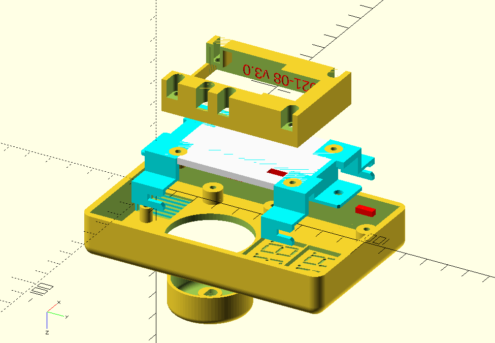

# Home Assistant Climate Controller

A wifi-enabled replacement for line-level electric heat controller thermostats installed in standard single-gang US electrical junction boxes

## Enclosure

OpenSCAD sources and rendered STLs for 3D printing

## PCB

EagleCAD schematics, boards, and reqresuite libraries.

## Software

Control software for ESPHome.io

## Reference

Part datasheets and vendor libraries